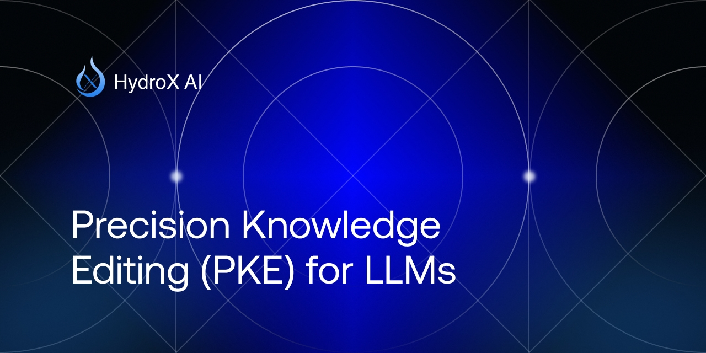

## Overview 🚀

**Precision Knowledge Editing (PKE)** introduces a groundbreaking technique aimed at enhancing the safety and reliability of large language models (LLMs) by effectively managing and reducing toxic content generation. PKE builds upon existing methods like Detoxifying Instance Neuron Modification (DINM), providing a more precise and robust approach to identifying and modifying toxic parameter regions within LLMs.

With applications across models like Llama2-7b, Llama-3-8b-instruct, and others, PKE outperforms previous methods, significantly reducing the attack success rate (ASR) while maintaining general model performance.

A demonstration of PKE in action can be found in our Jupyter Notebook recipe.ipynb. This notebook provides a hands-on walkthrough of the PKE method applied to Meta-Llama-3-8B, illustrating core concepts and methods.

## Key Contributions 🎯

1. **Enhanced Toxic Parameter Identification** 🔍: A new approach to identifying toxic parameters with finer granularity.
2. **Improved Safety Without Performance Loss** ✅: Robust evaluation metrics ensure model safety is achieved without compromising on general capabilities.
3. **Generalizable Across Model Architectures** 🔄: Tested on diverse models, PKE shows consistent improvements in toxicity management.

## Methodology 🧩

PKE leverages **neuron weight tracking** and **activation pathway tracing** to manage toxic content more effectively:

- **Neuron Weight Change**: Tracks changes in neuron weights to identify neurons that contribute to toxicity.
- **Activation Path Tracking**: Identifies which layers influence toxic outputs.
- **Local Region Identification**: Pinpoints "hot spots" in the model that are critical to toxicity.
- **Custom Loss Function**: Balances toxicity reduction with maintaining the correctness of outputs.

## Experimental Results 📊

Our experiments show that PKE achieves substantial ASR reductions compared to other methods:

| Model               | Vanilla ASR | DINM ASR | PKE ASR (Ours) |
|---------------------|-------------|----------|-----------------|
| Llama2-7b           | 67%         | 3%       | 2%             |
| Llama-3-8b-instruct | 97.60%      | 87.60%   | 8.5%           |


### Evaluation Metrics 📈

- **Attack Success Rate (ASR)**: Measures defense against adversarial prompts (lower ASR is better).
- **AlpacaEval**: Assesses general model capabilities.
- **Winrate and ROUGE-L**: Evaluates output quality and relevance.

## Limitations ⚠️

While PKE demonstrates significant improvements, it has some limitations:
- Primarily effective for prompt-based attacks.
- Evaluated on open-source models, so generalizability to closed-source models requires further research.

## Safe Model Access 🔗

Explore safe, PKE-enhanced models on [HydroX AI's Hugging Face Hub](https://huggingface.co/hydroxai).

## Citation 📜

If you use PKE in your research, please cite the following paper:
```plaintext
@article{li2024pke,
  title={Precision Knowledge Editing: Enhancing Safety in Large Language Models},
  author={Xuying Li, Zhuo Li, Yuji Kosuga, Yasuhiro Yoshida, Victor Bian},
  year={2024},
  journal={arXiv preprint arXiv:2410.03772}
}
